# Application MERN avec Kubernetes

## Aperçu du Projet

Ce projet démontre le déploiement d'une application MERN (MongoDB, Express.js, React, Node.js) sur un cluster Kubernetes. Il inclut :
- Déploiement des conteneurs avec Kubernetes
- Gestion de la configuration via ConfigMap
- Services pour la communication entre les composants
- Mise à l'échelle et mises à jour sans temps d'arrêt

## Structure du Projet

```
kubernetes-mern-app/
├── kubernetes/                  # Fichiers de configuration Kubernetes
│   ├── app-configmap.yaml       # Configuration des variables d'environnement
│   ├── mongodb-deployment.yaml  # Déploiement MongoDB
│   ├── mongodb-service.yaml     # Service MongoDB (ClusterIP)
│   ├── server-deployment.yaml   # Déploiement du serveur Node.js
│   ├── server-service.yaml      # Service du serveur (NodePort 30001)
│   ├── client-deployment.yaml   # Déploiement du client React
│   └── client-service.yaml      # Service du client (NodePort 30002)
└── screenshots/                 # Captures d'écran du déploiement
```

## Prérequis

- Docker Desktop avec Kubernetes activé
- kubectl installé et configuré
- Accès à un cluster Kubernetes (local ou distant)

## Déploiement

1. **Appliquer les configurations**
   ```bash
   cd kubernetes
   kubectl apply -f .
   ```

2. **Vérifier les déploiements**
   ```bash
   kubectl get all
   ```

3. **Accéder à l'application**
   - Client: http://localhost:30002
   - API Server: http://localhost:30001

## Opérations

### Mise à l'échelle
```bash
kubectl scale deployment server-deployment --replicas=5
```

### Mise à jour d'image
```bash
kubectl set image deployment/client-deployment mern-client=raefgaied4/mern-client:v2
```

### Surveillance
```bash
# Voir les logs du serveur
kubectl logs -l app=mern-server

# Voir les logs du client
kubectl logs -l app=mern-client
```

## Journal des Opérations

### 1. Configuration Initiale
- Application du ConfigMap
  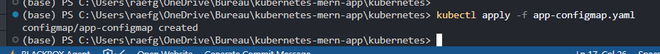

- Déploiement de MongoDB
  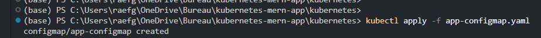
  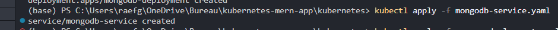

### 2. Déploiement du Serveur
- Déploiement du serveur
  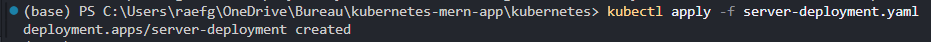
  
- Service du serveur
  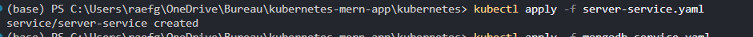

### 3. Déploiement du Client
- Déploiement du client
  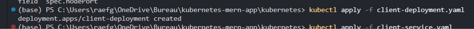
  
- Service du client
  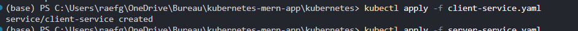

### 4. Vérifications
- Vue d'ensemble du cluster
  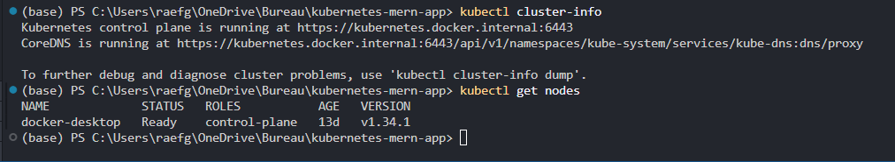
  
- Détails des déploiements
  
  
- État des pods
  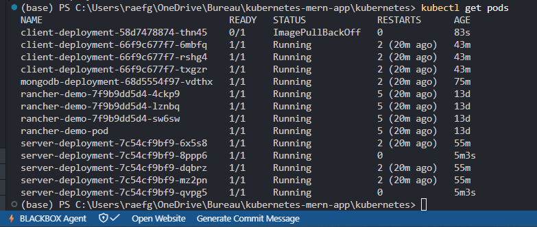

### 5. Logs d'Application
- Logs du serveur
  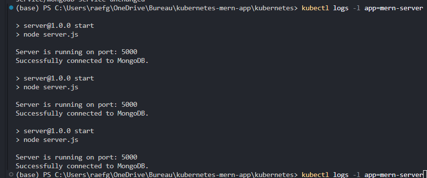
  
- Logs du client
  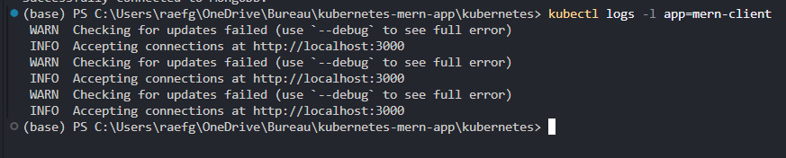

### 6. Mise à l'Échelle
- Scaling à 5 réplicas
  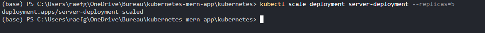

### 7. Mise à Jour
- Mise à jour de l'image
  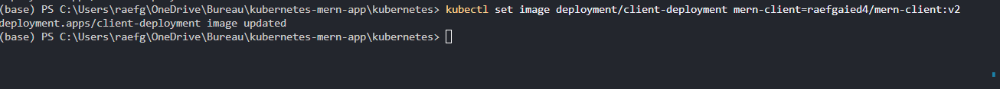

### 8. Vérification de l'Application
- Vue dans le navigateur
  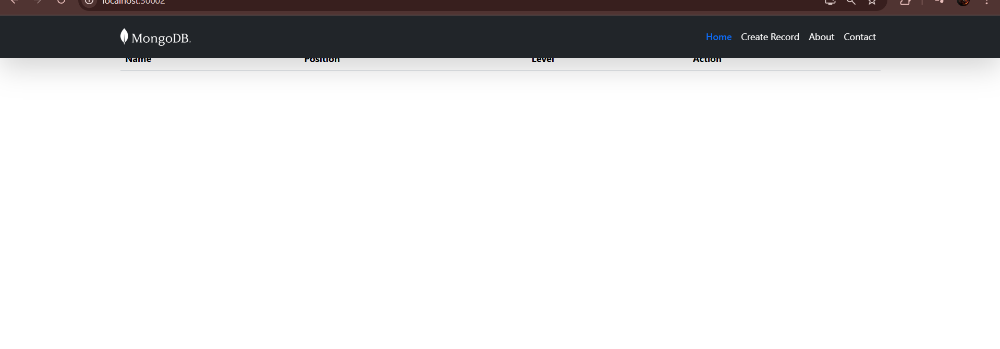
  
- Vue dans Docker/Kubernetes
  

### 9. Nettoyage
- Suppression des ressources
  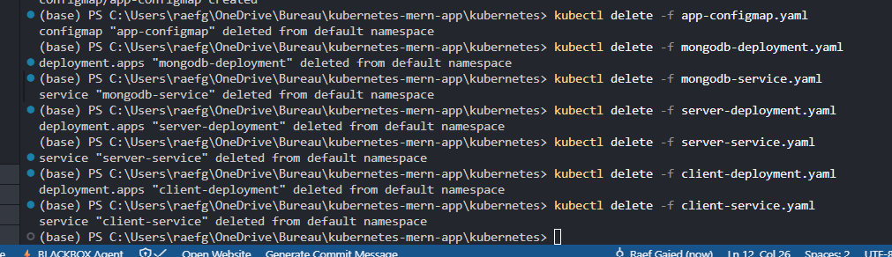

## Nettoyage

Pour supprimer toutes les ressources :
```bash
kubectl delete -f .
```

## Observations

- Tous les composants communiquent correctement
- La configuration via ConfigMap fonctionne comme prévu
- Les opérations de mise à l'échelle sont efficaces
- Les mises à jour se font sans interruption de service

## Auteur & Cours

- **Auteur**: Raef Gaied
- **Cours**: DevOps 2025-26
- **Professeur**: Dr. Salah Gontara
- **Date**: Novembre 2025

