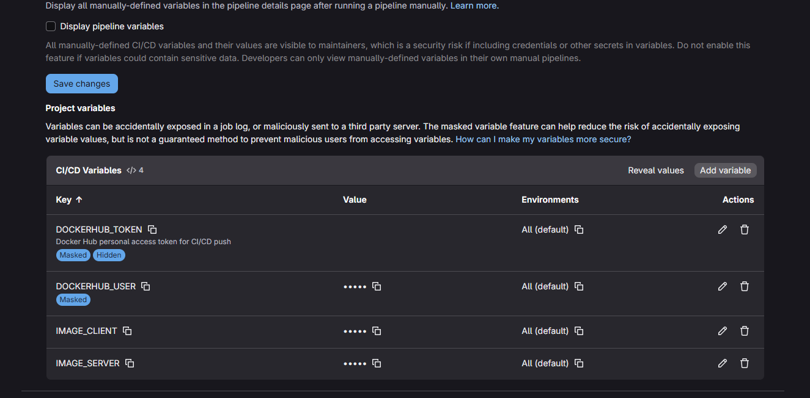
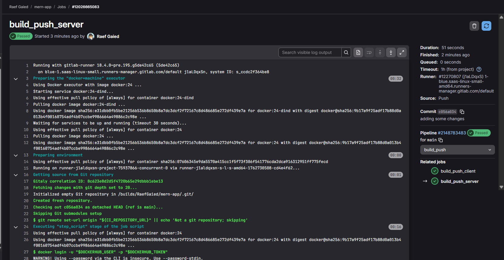
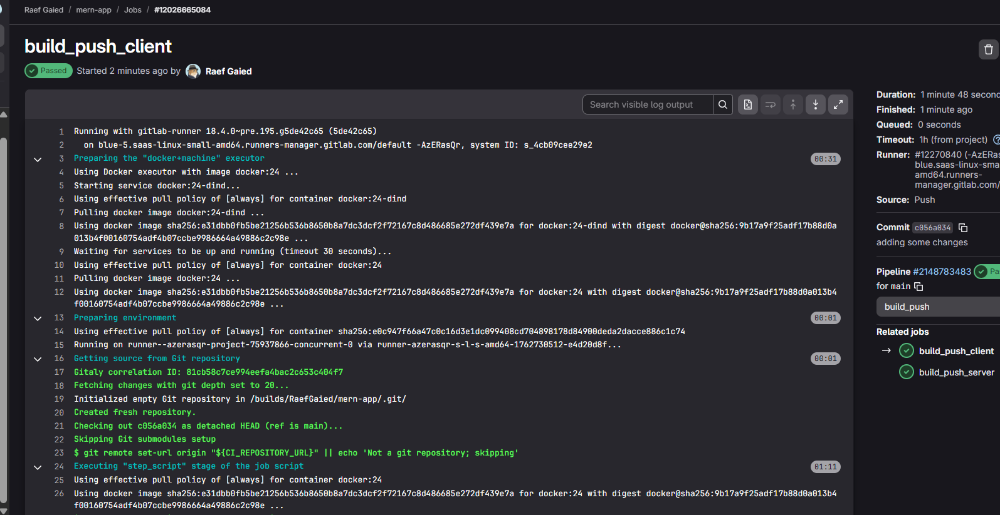
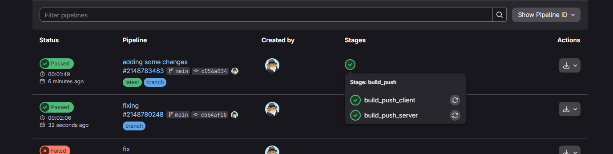
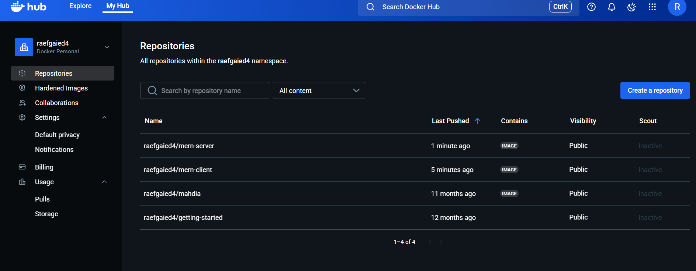

# CI/CD avec GitLab – MERN App (Server & Client)

## 🚀 Objectif

Mettre en place une pipeline **GitLab CI/CD** pour construire et pousser automatiquement les images Docker du projet MERN sur **DockerHub**. La pipeline détecte les changements dans le code serveur et client, construit les images correspondantes, puis les pousse vers le registre DockerHub.

---

## ⚙️ Configuration

### Variables CI/CD à ajouter dans GitLab

Accédez à **Settings → CI/CD → Variables** et ajoutez les variables suivantes :

| Variable | Exemple de valeur | Description |
|-----------|-------------------|--------------|
| `DOCKERHUB_USER` | `raefgaied4` | Nom d'utilisateur DockerHub |
| `DOCKERHUB_TOKEN` | `dckr_pat_****` | Token personnel DockerHub |
| `IMAGE_SERVER` | `raefgaied4/mern-server` | Nom complet de l'image serveur |
| `IMAGE_CLIENT` | `raefgaied4/mern-client` | Nom complet de l'image client |

**Capture de l'ajout des variables :**



---


## 📋 Fichier `.gitlab-ci.yml`

```yaml
image: docker:24

services:
  - docker:24-dind

variables:
  DOCKER_HOST: tcp://docker:2375
  DOCKER_TLS_CERTDIR: ""
  DOCKER_BUILDKIT: "1"
  IMAGE_SERVER: raefgaied4/mern-server
  IMAGE_CLIENT: raefgaied4/mern-client

stages:
  - build_push

build_push_server:
  stage: build_push
  rules:
    - changes: ["server/**/*"]
  script:
    - docker login -u "$DOCKERHUB_USER" -p "$DOCKERHUB_TOKEN"
    - docker build -t "$IMAGE_SERVER:$CI_COMMIT_SHORT_SHA" server
    - docker push "$IMAGE_SERVER:$CI_COMMIT_SHORT_SHA"

build_push_client:
  stage: build_push
  rules:
    - changes: ["client/**/*"]
  script:
    - docker login -u "$DOCKERHUB_USER" -p "$DOCKERHUB_TOKEN"
    - docker build -t "$IMAGE_CLIENT:$CI_COMMIT_SHORT_SHA" client
    - docker push "$IMAGE_CLIENT:$CI_COMMIT_SHORT_SHA"

```

---

## 🔄 Étapes exécutées par la pipeline

### 1️⃣ Build du Serveur (Server)
La pipeline détecte les changements dans le dossier `server/` et lance le build automatiquement.



### 2️⃣ Build du Client (Client)
De même, les changements dans le dossier `client/` déclenchent le build de l'image cliente.



### 3️⃣ Vue d'ensemble du Pipeline
Visualisez toutes les étapes du pipeline en temps réel.



### 4️⃣ Résultat sur DockerHub
Après le push automatique, les images apparaissent dans votre registre DockerHub.



---

## ✅ Résultat final attendu

Une fois la pipeline configurée et testée, vous aurez :

✅ **Détection automatique** des changements dans le code  
✅ **Build automatique** des images Docker  
✅ **Push automatique** vers DockerHub  
✅ **Historique complet** des déploiements dans GitLab  
✅ **Images taguées** avec le SHA court du commit pour traçabilité  

---

## 📁 Fichiers livrables

- `.gitlab-ci.yml` – Fichier de configuration du pipeline
- `README_GITLAB.md` – Documentation complète
- Dossier `screenshots/` – Captures d'écran du processus

---

## 🔗 Références

- [GitLab CI/CD Documentation](https://docs.gitlab.com/ee/ci/)
- [Docker Build Documentation](https://docs.docker.com/engine/reference/commandline/build/)
- [DockerHub Registry](https://hub.docker.com/)

---

**Projet** : MERN App  
**Auteur** : Raef Gaied  
**DockerHub** : [raefgaied4](https://hub.docker.com/u/raefgaied4)
